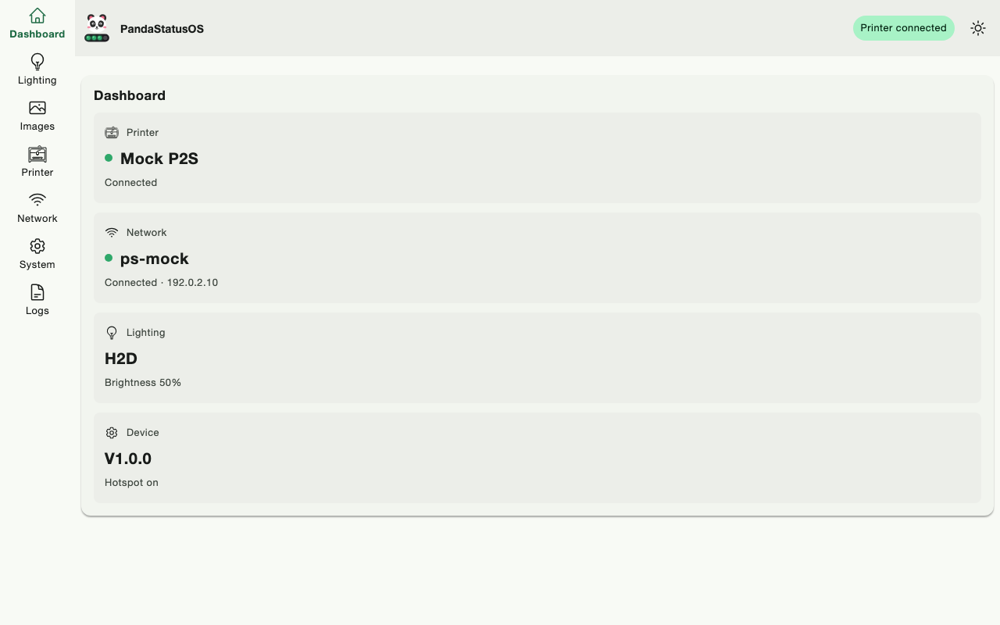
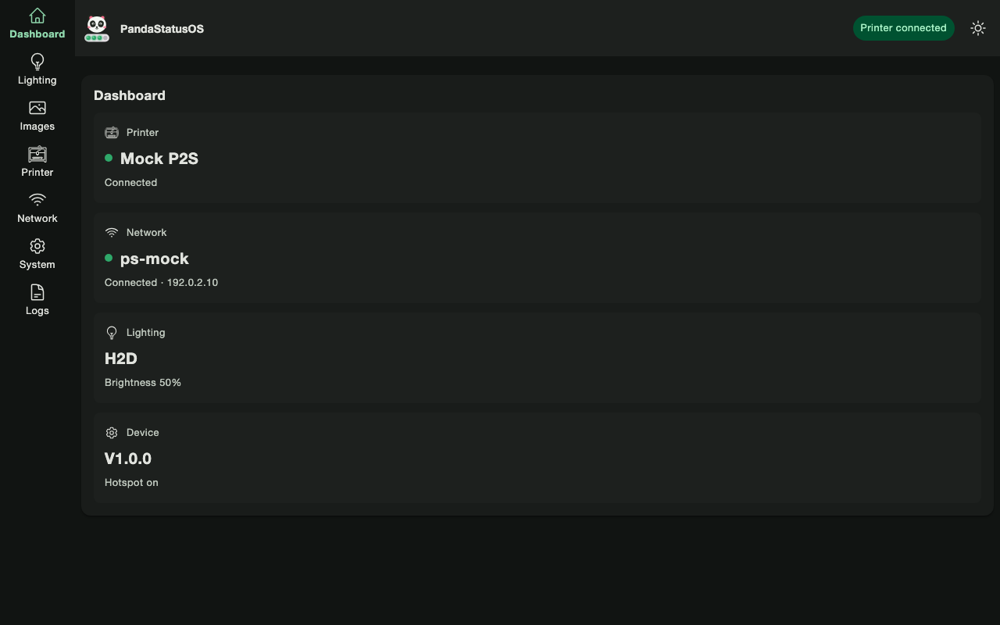
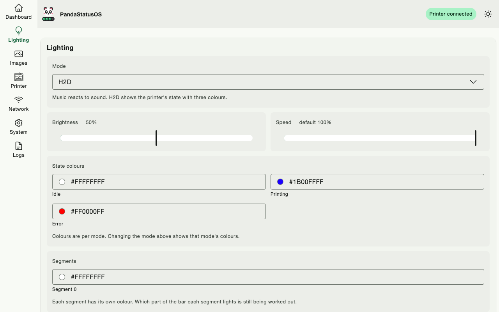
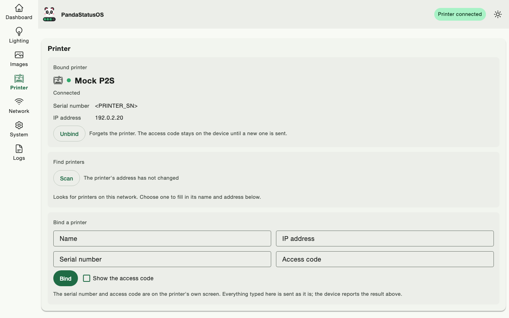
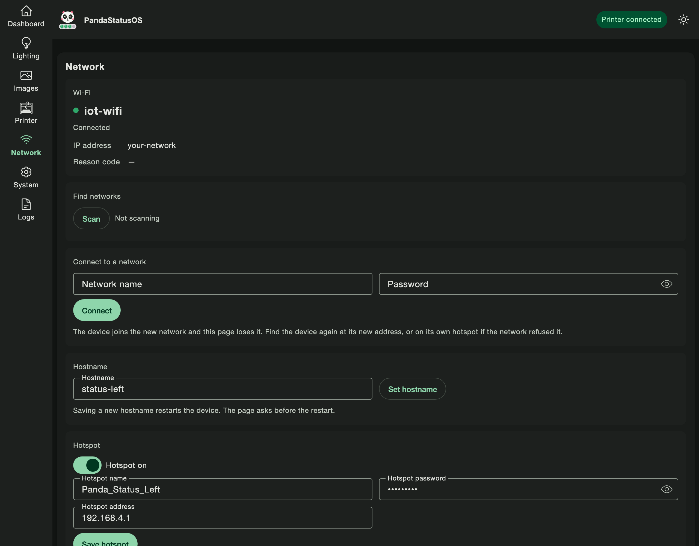
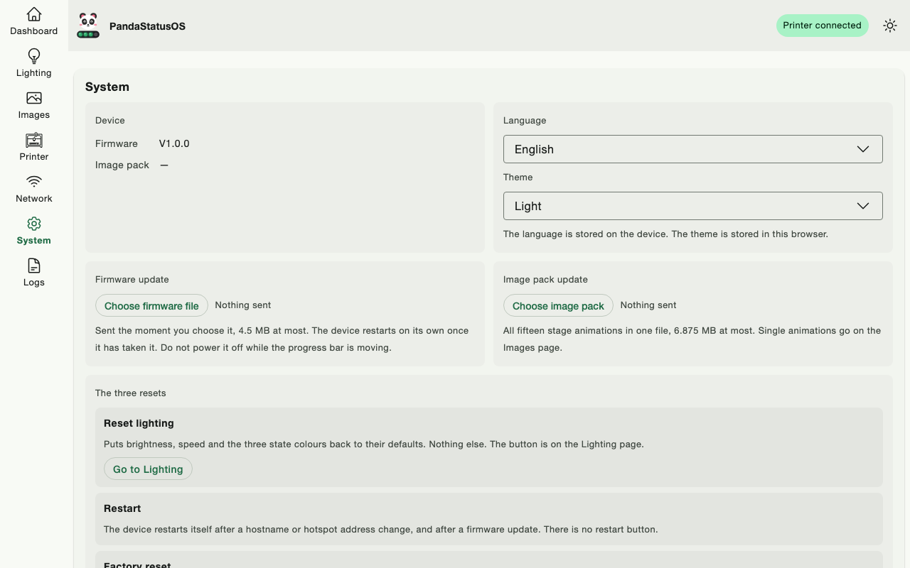
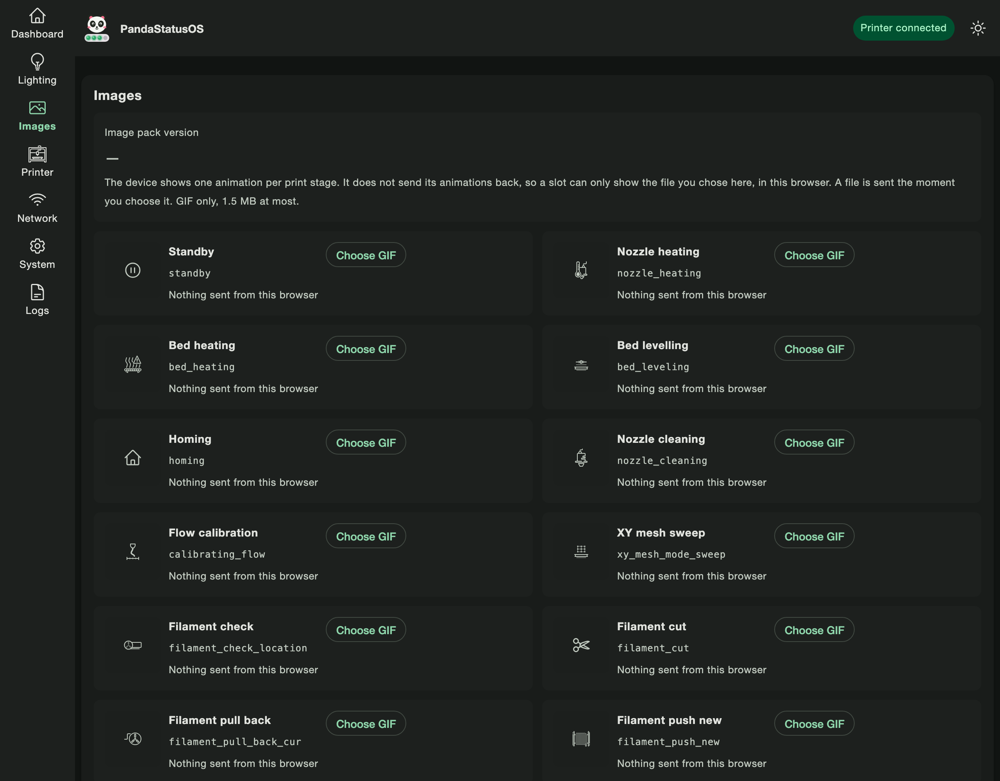
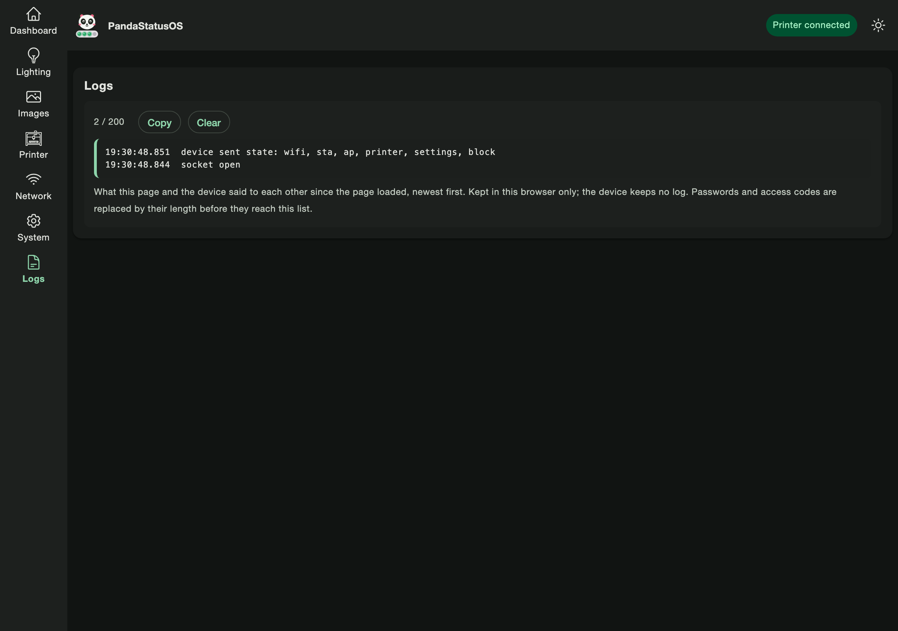
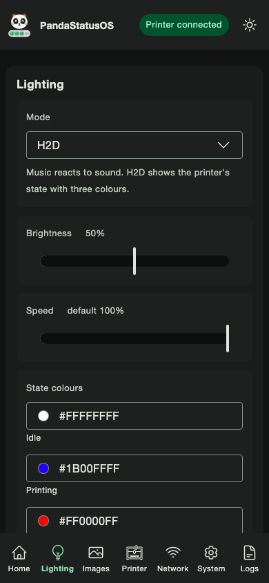
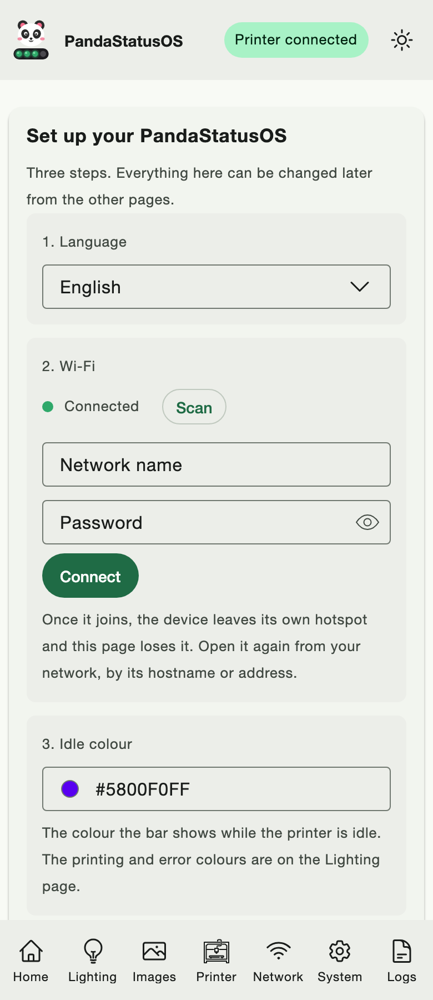

# PandaStatusOS

  <picture>
    <source media="(prefers-color-scheme: dark)" srcset="art/banner-dark.svg">
    
  </picture>

A clean-room firmware for the BIGTREETECH Panda Status P2, the LED status bar that
watches a Bambu Lab printer. Written from the observed behaviour of a stock unit, not
from its code, so it can be read, changed and rebuilt by anyone.

Not affiliated with, endorsed by, or supported by Shenzhen BIGTREE Technology Co.,
Ltd., BIQU or BIGTREETECH. This is a reimplementation, not a modification of their
firmware. "Panda Status" is their product name, used here only to identify the hardware
this runs on. Bambu Lab, AMS and P2S are Bambu Lab's.

## Where this stands

**Built against a mock device. No unit has been flashed.** Every page, every wire frame
and every firmware module in this repository was written from the protocol the stock
unit speaks and tested against a mock that speaks it back. The first flash of real
hardware is a deliberate, separate step, and it has not happened. Until it does, treat
every number about the flash layout as PROVISIONAL; the files say so themselves.

Read [firmware/SAFETY.md](firmware/SAFETY.md) before touching a device. Read the next
section before touching yours.

## The restore path comes first

**No P2 firmware image is published anywhere.** Not by the vendor, not by the
community. The only way back to the factory firmware is a full flash dump taken from
the unit before anything is written to it. There is no fallback, and the device cannot
put itself back.

So the order is fixed: back up, verify the backup twice, and only then install.
[backups/RESTORE.md](backups/RESTORE.md) is the document that gets a unit back to
factory from that dump, with every offset spelled out. It is written before the first
install, not after.

## What it does

The page the device serves, rebuilt as eight pages that speak the factory's wire
protocol frame for frame:

| Page | What it controls |
|---|---|
| Dashboard | printer link, network, lighting mode and brightness, firmware, hotspot |
| Lighting | Music or H2D mode, brightness and speed, the three state colours per mode, segments, reset |
| Images | the fifteen print-stage animations, one upload per slot |
| Printer | scan, bind by serial number and address with the access code, unbind |
| Network | Wi-Fi scan and connect, hostname, the hotspot's name, password and address |
| System | versions, language, theme, firmware and image pack updates, the three resets named honestly |
| Logs | what the page and the device said to each other, credentials replaced by their length |
| Setup | the first-run page: language, Wi-Fi, idle colour |

The default configuration is factory parity. Anything beyond it lives behind a flag that
defaults off; today there are none. [docs/FEATURES.md](docs/FEATURES.md) is the table of
flags and [docs/ROADMAP.md](docs/ROADMAP.md) the catalogue of what may be built.

## Screenshots

Taken by the harnesses against the mock, never against hardware. Every value on them is
a placeholder.

| Dashboard, light | Dashboard, dark |
|---|---|
|  |  |

| Lighting | Printer |
|---|---|
|  |  |

| Network, dark | System |
|---|---|
|  |  |

| Images, dark | Logs, dark |
|---|---|
|  |  |

| Lighting on a phone | Setup on a phone |
|---|---|
|  |  |

## Languages

Twenty-five. English is the only hand-written table; every other language is
translated from it and checked against it on every build for missing keys, extra keys
and placeholders. A language ships when all 248 strings are in it.

| Language | Native name | Code | |
|---|---|---|---|
| Arabic | العربية | `ar` | right to left |
| Chinese, Simplified | 简体中文 | `zh-Hans` | |
| Chinese, Traditional | 繁體中文 | `zh-Hant` | |
| Czech | čeština | `cs` | |
| Danish | Dansk | `da` | |
| Dutch | Nederlands | `nl` | |
| English | English | `en` | |
| Finnish | suomi | `fi` | |
| French | français | `fr` | |
| German | Deutsch | `de` | |
| Greek | Ελληνικά | `el` | |
| Hebrew | עברית | `he` | right to left |
| Hungarian | magyar | `hu` | |
| Italian | italiano | `it` | |
| Japanese | 日本語 | `ja` | |
| Korean | 한국어 | `ko` | |
| Norwegian Bokmål | norsk bokmål | `nb` | |
| Polish | polski | `pl` | |
| Portuguese, Brazil | português do Brasil | `pt-BR` | |
| Romanian | Română | `ro` | |
| Russian | русский | `ru` | |
| Spanish | español | `es` | |
| Swedish | svenska | `sv` | |
| Turkish | Türkçe | `tr` | |
| Ukrainian | українська | `uk` | |

## What it does not do, yet

- **Drive the bar the way the factory does.** The animations, Music mode's reaction to
  sound and the meaning of the speed value are recovered from the stock unit in Phase 1
  (see [docs/PLAN.md](docs/PLAN.md)). Until then the renderer paints the state colour, solid,
  at the set brightness, and says so in its source.
- **Know the flash size or the LED count.** Both are read off a real unit. The partition
  table is generated from one number so the real one is a single command away.
- **Discover printers on the network.** A scan finishes empty until a documented
  mechanism exists; binding by serial number and address works.
- **Publish Home Assistant entities.** The factory page exposes no broker setting, so
  there is nothing to mirror yet.
- **Verify the printer's certificate.** The printer presents a self-signed one; the link
  is encrypted but the server is not authenticated. The access code is the secret.

## Requirements

| | |
|---|---|
| Hardware | BIGTREETECH Panda Status P2 (ESP32-C3, RISC-V) |
| Firmware toolchain | ESP-IDF v5.3.1, the version the factory build reports |
| Page build | Python 3, gzip |
| Harnesses | Node 22 or newer, and Playwright installed under `private/uiwork/` (never in the repository) |
| Printer | a Bambu Lab printer on the same network, its serial number and access code |

## Install

1. Read [firmware/SAFETY.md](firmware/SAFETY.md). It explains why the order below is fixed:
   a sibling project lost its factory firmware for good to one flash that wrote the
   bootloader and partition table without a full backup.
2. Back up the unit: three reads of the whole flash over the cable, two must agree, one
   copy off the machine (`tools/fw/golden.sh usb --stock`; [backups/RESTORE.md](backups/RESTORE.md), Part B).
3. Build against the unit's own partition table, read from that backup
   (`tools/fw/partitions_from_dump.py`): [docs/BUILDING.md](docs/BUILDING.md).
4. Install over the network: `tools/fw/ota-install.sh`, [docs/FLASHING.md](docs/FLASHING.md).
   The first install is an OTA into one of the stock firmware's own app slots; the
   bootloader, the partition table, the settings and the animations are never written.
   `tools/fw/preflight.sh` refuses every install until step 2 is complete and verified,
   and it has no override. Updates after that go through the System page or the same
   script, which proves that a flash landed rather than trusting the device's 200.

## Going back

Three ways, in order of how much they write, all in [backups/RESTORE.md](backups/RESTORE.md):
the factory app back over the network (no cable), the factory app into one slot over the
cable, and the whole image back over the cable, which is the only one that touches the
bootloader. The clone also serves `GET /backup`, the whole flash over Wi-Fi in seconds, so
every later restore point costs nothing. The factory image is the vendor's and is not
redistributed here; the copy you took is the only one there is.

## Project layout

| Path | What |
|---|---|
| `firmware/` | the ESP-IDF project: `main/` modules, `partitions.csv` (generated), `sdkconfig.defaults`, host tests under `test/host/` |
| `firmware/main/ui.html` | the served page, BUILT by `tools/ui/build/build.py` and committed; its gzip is derived at build time |
| `firmware/main/vendor/` | every third-party component with its licence and the sha256 of what ships |
| `tools/ui/` | page sources, the build, the string tables, the mock device, the harnesses |
| `tools/fw/` | the partition table generator |
| `tools/art/`, `art/` | the marks, generated from primitives |
| `docs/` | architecture, protocol, config, features, building, flashing, troubleshooting, decisions, roadmap, screenshots |
| `backups/` | the restore document and the stock capture run sheet; the dumps themselves live outside the tree |
| `.githooks/` | the pre-commit hook that keeps secrets and vendor material out |

## Testing

| Command | What it proves |
|---|---|
| `tools/ui/harness/sweep.sh` | every page against the mock at both themes and both widths, every control's exact wire frame, contrast on every page, and one row per lie the device can tell (30 rows) |
| `make test-fw` | on the host: the config module's load, save, defaults, clamps and migrations (32 assertions), and the state module's six-root document and inbound dispatcher against the protocol document (41) |
| `make test-hook` | the pre-commit hook's regression suite |
| `make residue` | the tracked tree carries nothing of the vendor's expression |
| `python3 tools/ui/build/build.py --check` | the committed page is exactly what the build produces |

## Documentation

| Document | What |
|---|---|
| [docs/ARCHITECTURE.md](docs/ARCHITECTURE.md) | firmware structure, task model, the page build pipeline |
| [docs/PROTOCOL.md](docs/PROTOCOL.md) | the whole wire surface: WebSocket, HTTP, MQTT |
| [docs/CONFIG.md](docs/CONFIG.md) | every stored key, its type, range and default |
| [docs/FEATURES.md](docs/FEATURES.md) | every flag, its default and its dependencies |
| [docs/BUILDING.md](docs/BUILDING.md), [docs/FLASHING.md](docs/FLASHING.md), [docs/TROUBLESHOOTING.md](docs/TROUBLESHOOTING.md) | building, flashing, and what to do when something does not work |
| [docs/DECISIONS.md](docs/DECISIONS.md) | every decision, its alternatives, its reversal cost |
| [docs/ROADMAP.md](docs/ROADMAP.md) | what may be built, in tiers, and what each tier waits on |
| [docs/PLAN.md](docs/PLAN.md) | the three phases, the five gates, the evidence standard |
| [docs/API.md](docs/API.md) | the JSON surface: discovery, the read-only routes, the switches' routes, the rules |
| [CONTRIBUTING.md](CONTRIBUTING.md) | the standing rules, the clean-room rule, the sweep, the naming convention, the harnesses |
| [CHANGELOG.md](CHANGELOG.md) | what changed |

## Vendored components

Nothing ships without a row in [firmware/main/vendor/README.md](firmware/main/vendor/README.md).

| Component | Version | Licence | Used for |
|---|---|---|---|
| [Beer CSS](https://github.com/beercss/beercss) | 5.0.3 | MIT | the page's components and Material 3 tokens |
| [Coloris](https://github.com/melloware/coloris-npm) | 0.25.0 | MIT | the colour picker |
| [Heroicons](https://github.com/tailwindlabs/heroicons) | 2.2.0 | MIT | ten outline icons, hashed one by one |
| Roboto | pending | SIL OFL 1.1 | reserved; the page uses the system font until a subset is vendored |

## Licence

MIT, [LICENSE.md](LICENSE.md). The vendored components keep their own licences, listed
above and in their directories.
